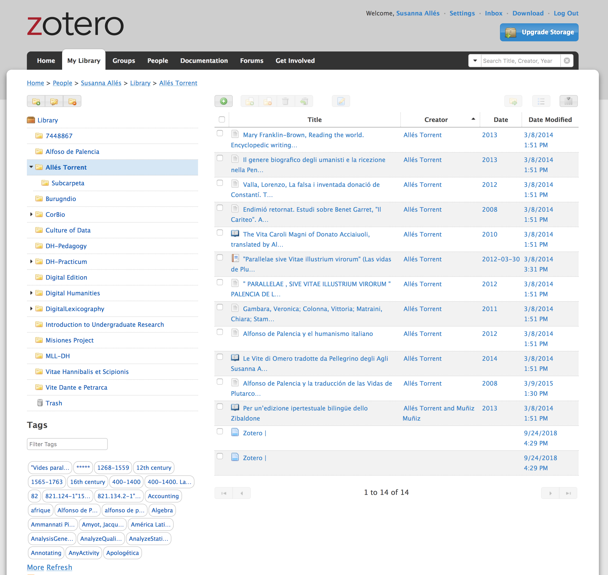
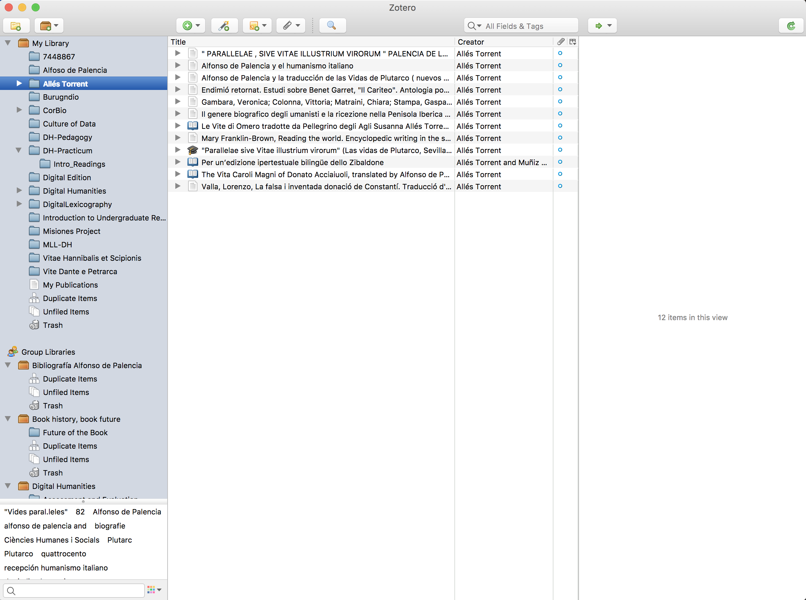
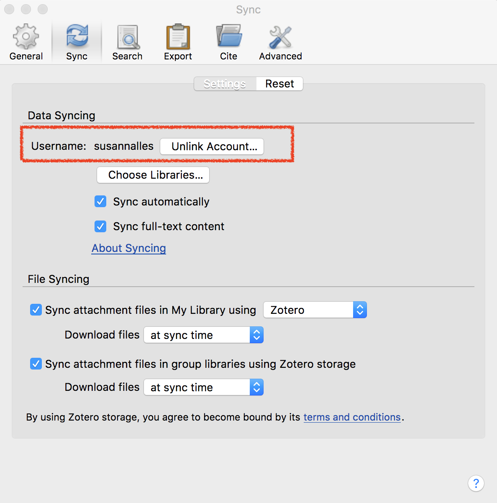
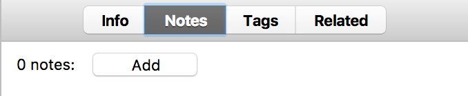
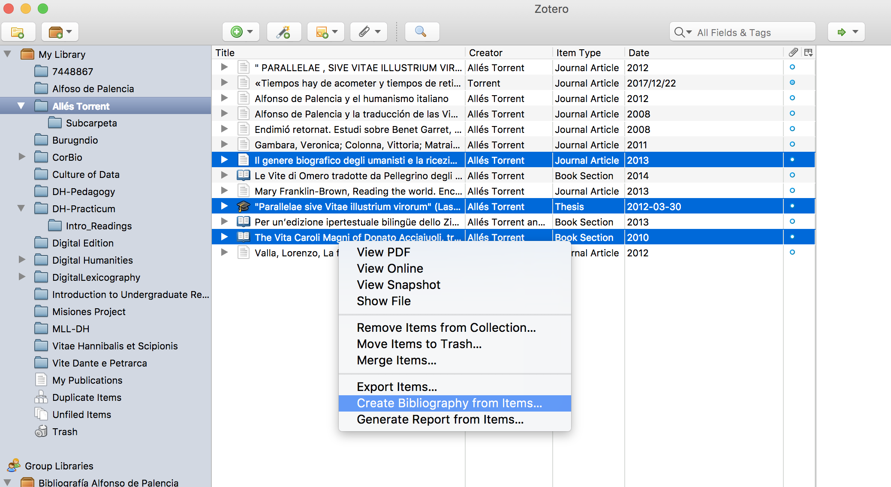
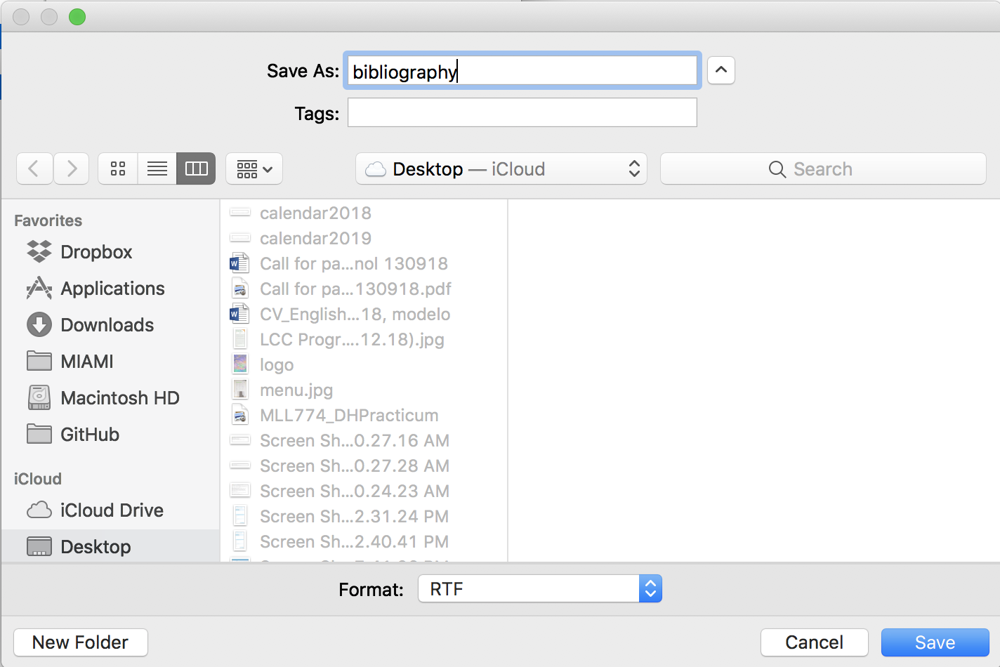
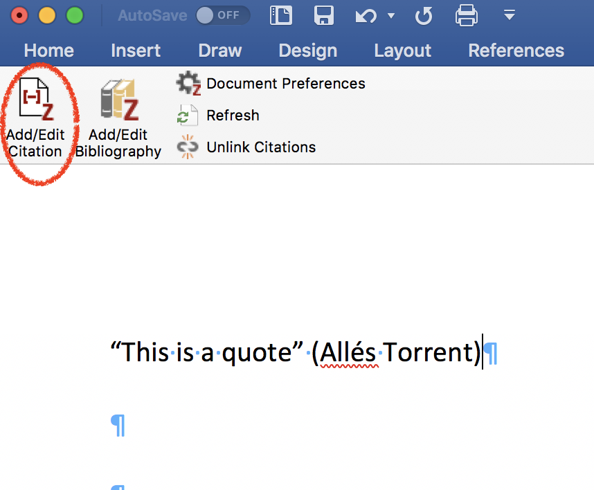
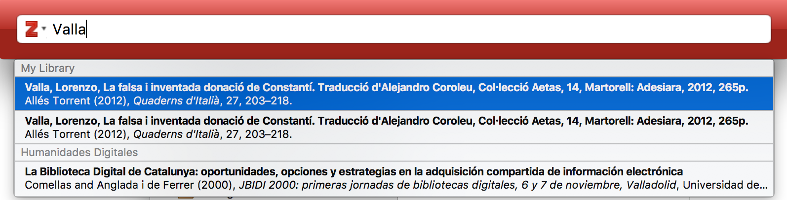

# What is Zotero? 

Zotero is a citation managment tool. It is free and multiplatform (Windows, Linux, Mac).  

The last version, Zotero 5.0, is used as an standalone software on your machine and as a Firefox extension (It can be used with Chrome and Safari but the plugin extension is not completely developed).  

Zotero helps you to "collect, organize, cite, and share research". 


# Step 1: Create username and install Firefox connector

- Download and Install [Firefox](https://www.mozilla.org/en-US/firefox/new/), if you don't have it. I recommend you to use this browser instead of Edge, for example. 
- Create a username in Zotero: <https://www.zotero.org/user/register>


Once you are logged in, you can manage your folders and all your items: 



At this point, you can try to create a folder collection realted to this course or to your disseration. 

## Sept 2: Download Zotero

The best way to use Zotero is an standalone app, as such you can use it even if you don't have an internet connection: 

- [Download Zotero 5.0](https://www.zotero.org/download/)



Now, you have to download the Firefox Connector to be able to collect all items that you need for your bibliography: 

- [Download Zotero Firefox Connector](https://www.zotero.org/download/) 


Once you have install the connector you will need to restart your browser, and you will see a litle icon on the top right corner that indicate the type of document that the browser is displaying: 


Open your Zotero app, login with your credentials, and start exporting articles, books, etc. that you whish. 

## Step 3: Syncornization with your Zotero account 

Zotero is syncronized with your app and with the online platform. Be sure at the very begining that you login with your credentials, at Zotero > Prefernces 



If sometimes you need to syncronize it faster or be sure that everything is up to date, click the sync botton in the top right corner of your app:

 

## Step 4: Create a Collection 

You can create collections from the online platform or from your app, by clicking in this icon:
 


## Step 5: Collect bibliographical items

Go to UM catalog library and find some bibliography you need <https://www.library.miami.edu/>. 

- Download at least 4.  
- Visualize in the list: title, Creator, Item Type, Date 
- Explore the Metadata section: Infos, Notes, Tags, Related 

## Step 6: Add notes, and tags 

For each item, you can add personal notes, and also tags or keywords. 




## Step 7: Collaborate and share bibliography 

To create a Group collection that will be shared with other people: 


## Step 7: Export in different citation styles 

Choose the items you want in your bibliography 



Choose the style you want (MLA, Chicago, etc.): 


Save it in rdf format or docx or pdf: 



And voilà: 


## Step 8: Export it directly to Microsoft and LiberOffice

Last versions of Microsoft Word have the Zotero plugin installed automatically when you install the app. So it is easy as open Word after the installation and you have it: 


While you write, you can add and edit citations in your text. 



For which, a pop-up windwow will appear with all your items:



And at the end you can create the full bibliography which will be created with the items that you have cited. 


## Timelines

You can create a timeline of your bibliography, going to Tools > Create Timeline: 


## And the coolest thing: Zotero API 

You can do many things with the API, one of which is to import your bibliography directly to your webpage with a line of code: 

```html
h2>Diachronic Spanish Corpus Linguistics</h2>

<?php $URL='https://api.zotero.org/users/1167759/collections/GCNLKMRQ/items?format=bib&style=chicago-author-date'; $var=file_get_contents($URL); echo $var?>
	
</div>
```


