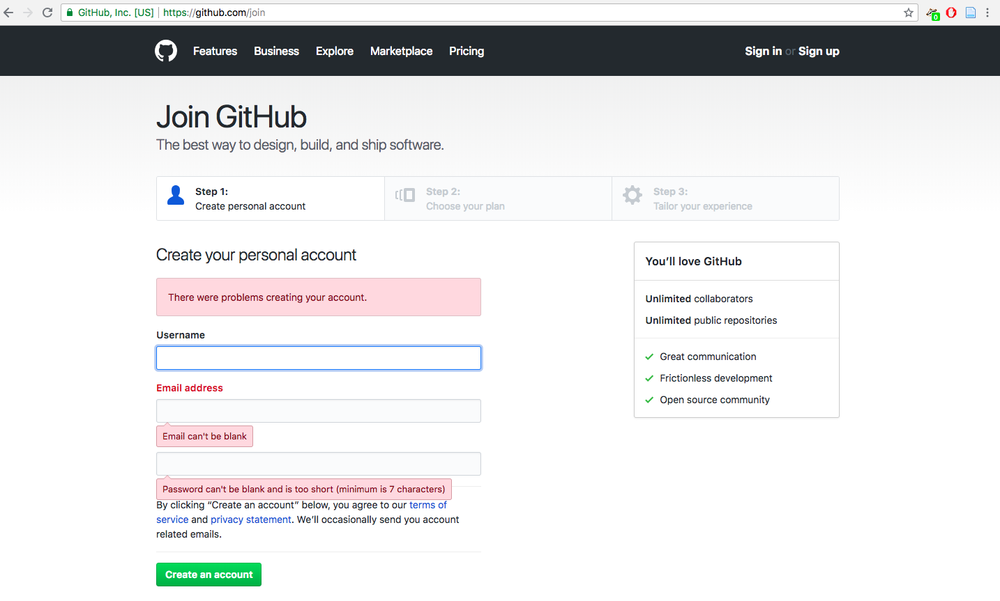
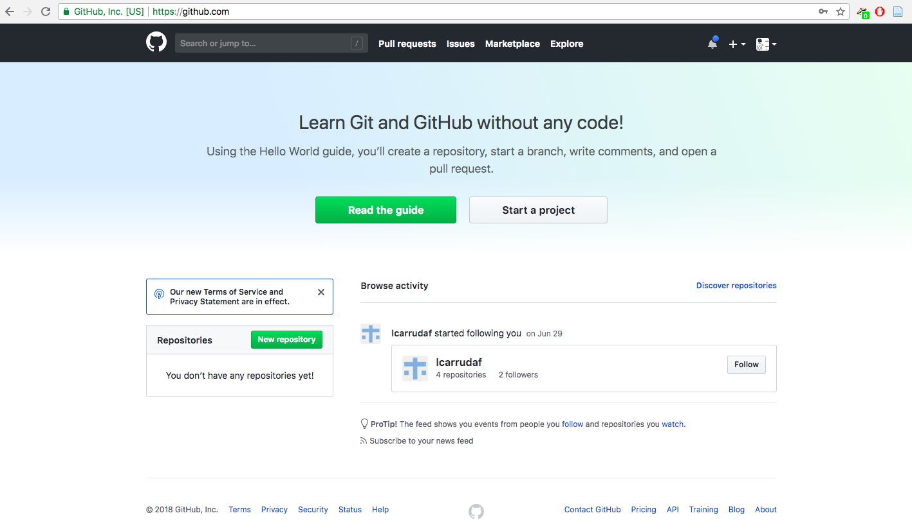
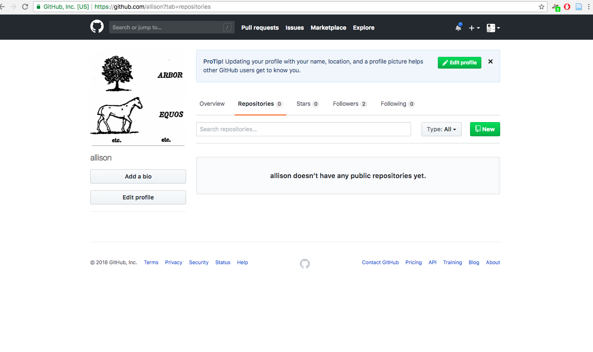
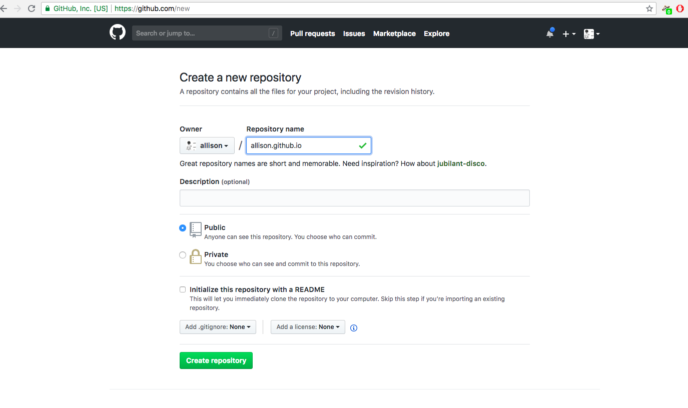
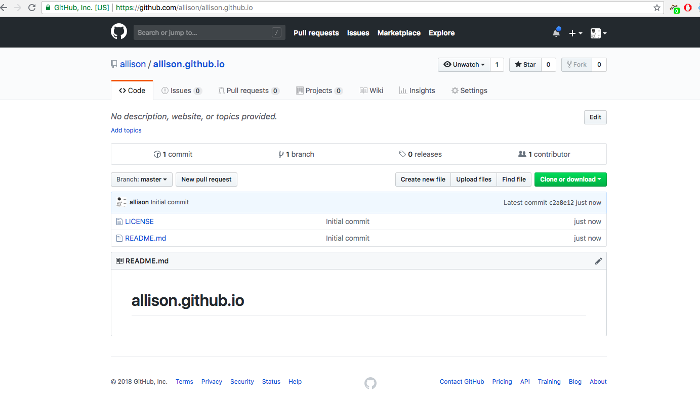
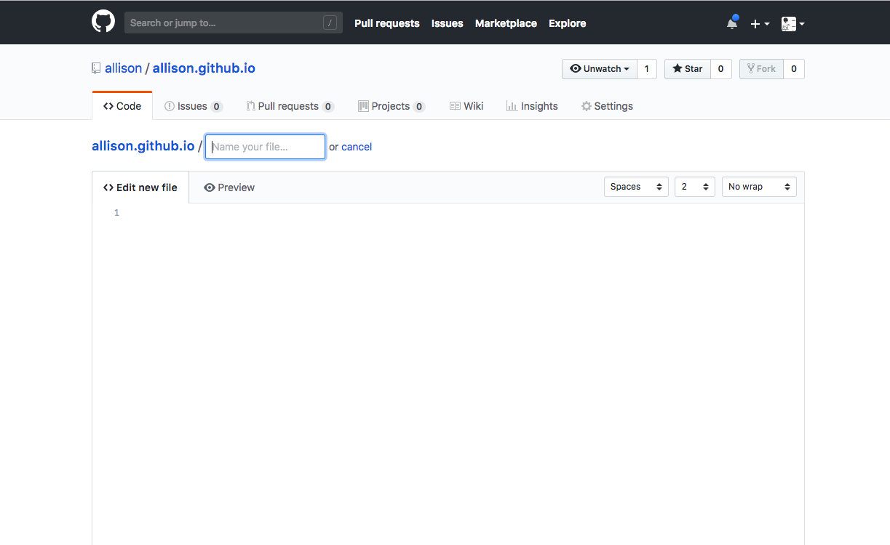
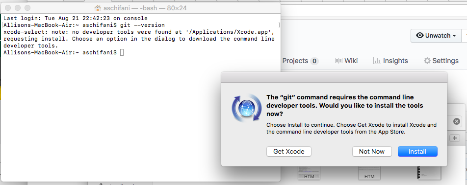
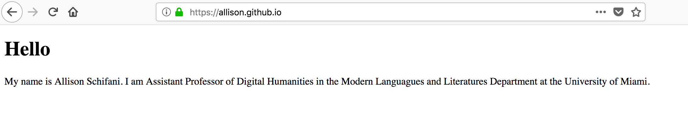

# Create Username & Activate GitHub Pages 

Go to <https://github.com/join> and create your account. Be careful with which username you choose because it will be the name it appears in your url. 



Once you are signed in, you have to create a new repository where you will host your project. 



Or go to My Account > Your Repositories and click on "New"



For the name, it has to be 'username.github.io' where username is the one that you chose to create your Github account. As in "Description", you can say something like "My GitHub Pages Repo" or whatever you want. Leave it "Public", and click on "Initialize this repository with a README" file. 



Once it is created you will see this: 



Now let's create directly into GitHub a simple html page that we will name it "[index.html](https://github.com/susannalles/DHPracticum/blob/gh-pages/practice/index2.html)":



You can write a simple code with just a title and a paragraph or copy and paste this code: 

```html
<!DOCTYPE html>
<html>
    <head>
        <title>Your title</title>
        <style>
            body {
                background-color: #e6e2d3;
                font-family: "PT Sans", Helvetica, Arial, sans-serif;
            }
            
            h1 {
                color: #bd5734;
            }
            p {
                color: #587e76;
            }</style>
    </head>
    <body>
        <h1>This is a heading</h1>
        <p>This is a paragraph.</p>
    </body>
</html>
```

If you are on MAC you might see this poping up, say "Install" (you will need this at some point):



Now, you should be able if you go to https://username.github.io/ (the name of your repository) to see your new online space where you will create your eportofio: 



Enjoy your new virtual space! 
