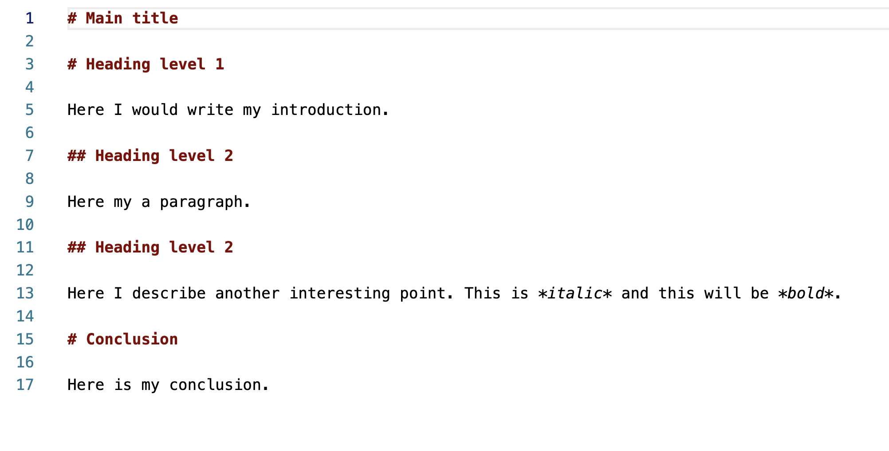
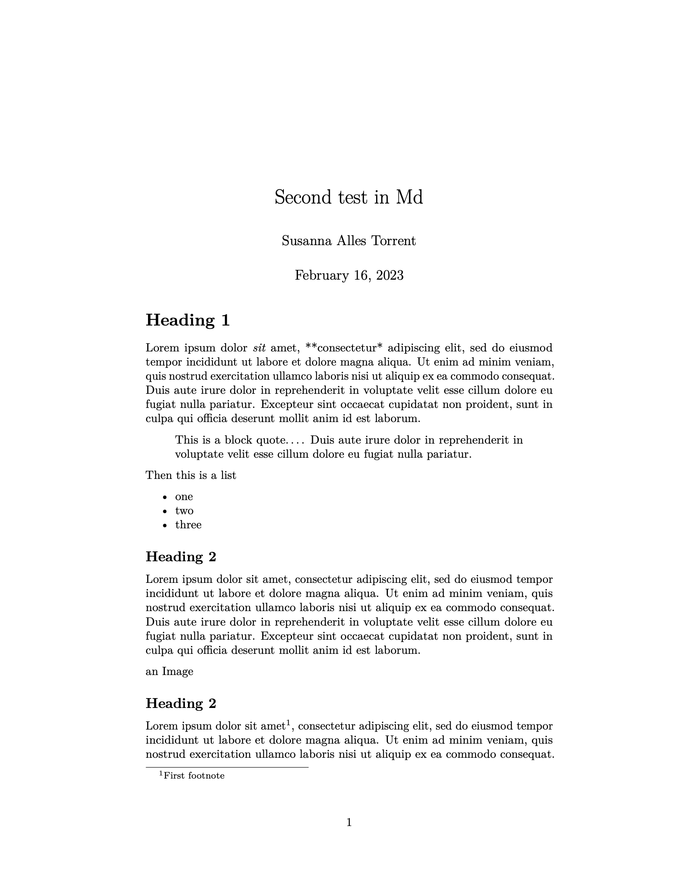
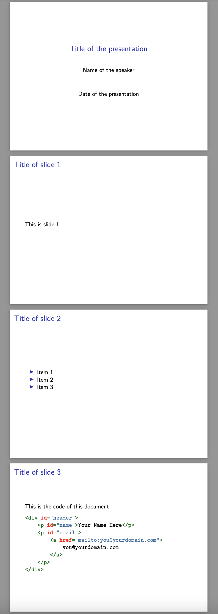

# What you need to work with Markdown and Pandoc?

- A plain text editor (Mac, Linux, Windows): [Visual Studio Code](https://code.visualstudio.com/)
- Command Line
  * Mac: cmd+space, type "terminal"
  * Windows: hit Super/Windows key, type "powershell" and press Enter
- [Pandoc](https://pandoc.org/installing.html) to convert to different files.
- Some latex version to create pdf files
    - [Miktex](https://miktex.org/) works on Mac, Linux and Windows.
    - On Mac, [basictex](www.tug.org/mactex/morepackages.html) also works fine.
- Online alternative: <https://dillinger.io/>
- Download this [file](http://susannalles.com/markdown.zip)

# What is Markdown?

- `.md` is a markup language that you can use to add formatting elements to plaintext documents.
- one of the world’s most popular markup languages
- it only cares for writing, not formatting (WYSIWYG)
- it is light enough to read it in naked eye
- you can use any text editor application

# Why to use Markdown

- Markdown can be used for everything: create websites, documents, notes, books, presentations, email messages, or technical documentation.
- Markdown is portable, you can use any application (open-access) (vs Microsoft Word is a proprietary file format)
- Markdown is platform independent (any operating system)
- Markdown is used worldwide and it is used for websites like Reddit or GitHub.
- Markdown is a fast and easy way to take notes, create content for a website, and produce print-ready documents.

# Why not Microsoft Word or Google Drive?

- Word seems easy now, but it will drive you crazy in the long run.
- Microsoft Office package is expensive.
- Files are not universal.
- Word is very distractive.
- Problems with incompatibility.
- Files are heavier and tend to corrupt.
- Problems merging files, copying text from other files, numbering.

See [RafaDavis](https://github.com/rafadavis/markdown-workshop/blob/master/README.md)

# Why should I use Markdown?

- Beautiful professional formatting without much work.
- It can easily be converted to other formats: doc, pdf, html, etc.
- Separation of form and content allows you to focus on your writing.
- Text editors are meant to be worked with text structure, so they force you to think about the organization of your writing.
- Future proofing your files: plain text files are universal. They will work on any computer, of any operational system, forever.
- There is no lock-in. If you don't like it, you can convert the files to doc files and go back to work the way you used to.
- The more you learn, the more powerful tools you can access, such as automatic citations.
- If you are writing a dissertation, or a thesis, there is a good chance your university has the template ready, so you don't need to worry about adjusting to their standards.

See [RafaDavis](https://github.com/rafadavis/markdown-workshop/blob/master/README.md)

# You even can create Websites

- Jekyll: <https://www.markdownguide.org/tools/jekyll/>
- Blot: <https://blot.im/>
- Small Victory:  <https://www.smallvictori.es/>
- Other static web generators: <https://jamstack.org/generators/>

# The basics

Check this [Cheatsheet Markdown Syntax](https://guides.github.com/pdfs/markdown-cheatsheet-online.pdf) and leave it open to consult it. 

--------------

# Step 1: Create a Markdown file

Work locally, and open your text editor, such as VSC. A Markdow file is nothing more than a text file, saved with the extension ".md".

- Open the file `test1.md`
- Edit it as you like taking some elements from the Cheatsheet Markdown Syntax
- Save it



## Now, how do we transform this?

- There are different ways to transform `.md` into other formats.
- The most common is [Pandoc](https://pandoc.org/): a collection of parsers and scripts that transform a plain text file in `.md` into HTML, PDF, doc, Slides, etc.
-  We will use the terminal
  * Mac: press *CMD + Space*, type "terminal" and press *Enter*
  * Windows: hit *Super/Windows* key, type "powershell" and press Enter

## Basic commands for the terminal

- `pwd`: Present working directory
- `ls`: List Directory
- `mkdir`: Make Directory
- `cd`: Change Directory
- `cd ..`: Change to parent directory

Type:

- `cd Documents` or go to your DHPracticum folder 
- `mkdir MarkdownWorkshop` 
- `cd MarkdownWorkshop`

# Step 2: Install Pandoc

- You had to install [Pandoc](https://github.com/jgm/pandoc/releases/tag/2.3.1) to convert `.md` towards different files.
- You will need to install as well a Latex version to create pdf files:
    - [Miktex](https://miktex.org/) works on Mac, Linux and Windows.
    - On mac, [basictex](www.tug.org/mactex/morepackages.html) also worked fine.
- If Pandoc or Latex is not correctly installed, this will not work.

# Step 3: Transformation

- Go to your terminal (you should be there already but it you are not type `pwd` and `cd` to our folder "MarkdownWorkshop")
- Type simply: `pandoc test1.md -o test1.pdf`
- Go to you folder and check the new PDF
- Do the same to convert it into a Microsoft doc: `pandoc test1.md -o test1.docx`
- And into an html page: `pandoc test1.md -o test1.docx`

# Step 4: Open test2.md

- Explore this document and try to transform it from the terminal: `pandoc test2.md -o test2.pdf`
- Remember: To create other types of documents, you only need to change the extension. For instance, if you want a Word doc, type "pandoc -o test2.docx test.md". Same goes for ".html", ".odt", etc.
- Into a HTML: `pandoc test2.md -o test2.html`
- Into a Doc: `pandoc test2.md -o test2.odt`
- You can also edit YAML metadata: 

```yml
---
title: Second test in Md
author: Susanna Alles Torrent
date: February 16, 2023
---
```

Here is the result: 



# Sept 5: use Markdown for your presentations 

With Pandoc you can also convert your markdown files into simple slides for a presentation using a function called 'beamer'. 

- Open the file called `presentation.md` and go through the content you can edit with your name if you wish. 
- Go to your command line and simply type: `pandoc -t beamer presentation.md -o presentation.pdf`
- The results are these: 



# Sept 6: Now transform this markdown tutorial into a presentation and a simple pdf 

- Go to your terminal, write the name of the file and the ouput, and do a pdf: `pandoc tutorial.md -o tutorial.pdf`
- Now transform the file into a presentation: `pandoc tutorial.md -o tutorial_presentation.pdf`


# And what about your disseration?

There are a lot of templates out there you can use:

- Template for U Oxford: <https://github.com/tompollard/phd_thesis_markdown>
- markdown-paper: <https://github.com/ihrke/markdown-paper/tree/master/pdf>
- Overleaf: <https://es.overleaf.com/gallery/tagged/markup>

I particularly love this one [Eisvogel Template](https://github.com/Wandmalfarbe/pandoc-latex-template), that I used to transform the md file behind [this tutorial](https://tthub.io/aprende/l1-intro-a-tei/) into [this pdf](https://zenodo.org/record/4430863#.YDWABmMo_L8)

